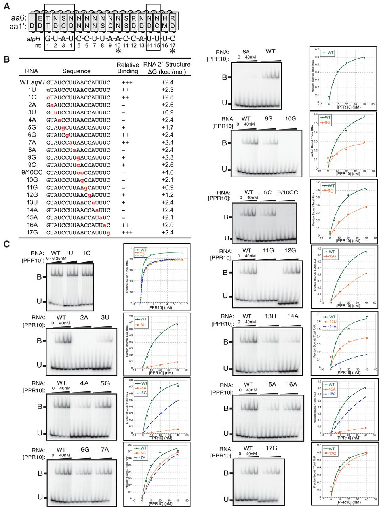
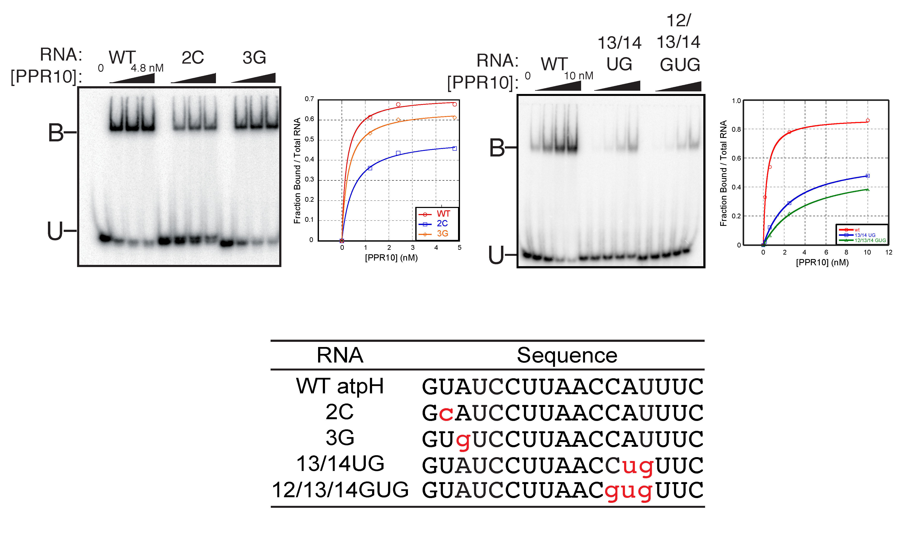
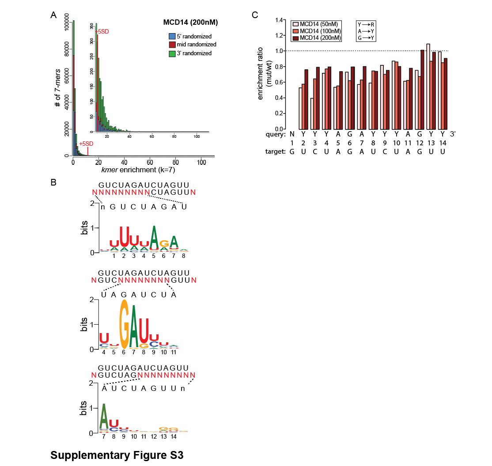
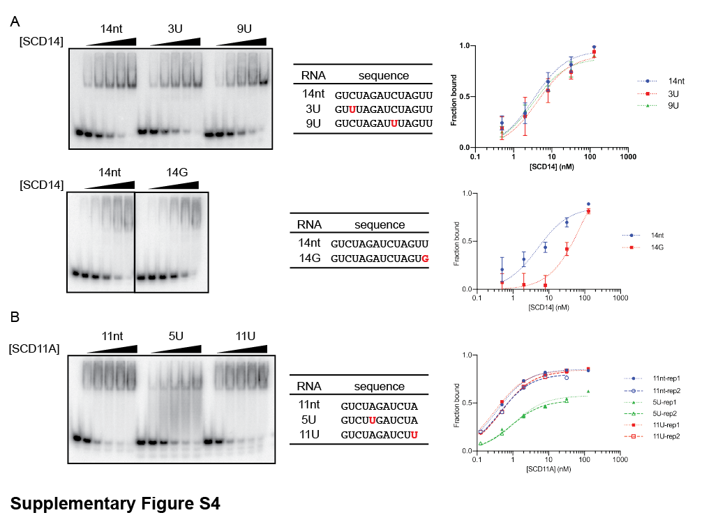

# **Workshop: Analysing RNA-RBP Interaction Experiments**  

## **Overview**  
This page summarises the RBP workshop for practicing the analysis of **Electrophoretic Mobility Shift Assays (EMSAs)** and other methods used to study RNA-Protein interactions. The workshop focuses on interpreting key experimental data from **Miranda et al. (2017, 2018) and McDermott et al. (2019)**, with guided questions to enhance understanding.

## **Core Questions for Each Figure**  
For each experiment, consider the following:  

1. **Why was this experiment done?**  
   - What hypothesis or research question does this address?  

2. **How was it done?**  
   - What experimental setup, controls, and conditions were used?  

3. **What can we conclude?**  
   - What do the results tell us about RNA-RBP interactions?

## **Quick Guide to EMSA Analysis**

### **1. Why was this experiment done?**
- To test if an RNA binds to a specific protein?  
- To determine the **binding affinity** of RNA-Protein interactions?
- To assess competition or specificity using mutant RNA/protein or competitors?  

### **2. How was it done?**
- RNA and protein were mixed and run on a **native gel**?  
- RNA was identified by PCR or sequencing? What method exactly and why?
- Was the Protein unknown, known or synthetically made?
- What **controls are used?:**
  - Free RNA  
  - Protein alone  
  - Competitor RNA  
  - Mutant RNA/protein

### **3. Estimating Kd from EMSA**  
- Was **Kd (dissociation constant)** calculated or estimated?  
- Is there an EMSA plot with **fraction bound vs. protein concentration**?  
- Did multiple binding get assessed? **Lower Kd** → stronger binding, **higher Kd** → weaker binding.  

### **4. What can we conclude?**
- Qualitative: **Shift present** → RNA binds to protein.  
- Bigger picture: **Super-shift with antibody** → Confirms the specific protein in the complex.  
- Identifying role of individual bases: **No shift with mutant RNA/protein** → Binding is sequence- or structure-specific.  
- Multiple Players: **Loss of shift with competitor RNA** → Interaction is specific and competitive.  
- Optimizing Binding: **Comparing of shifts with increasing protein** → Shows binding affinity (Kd estimation).  

## Table of Contents
### **Miranda et al. (2017) RNA 23:586–599**
- **1.** [Figure 3](#figure-3)  
- **2.** [Figure S3](#figure-s3)  

### **Miranda et al. (2018) NAR 46:2613–2623**
- **3.** [Figure S1](#figure-s1)  
- **4.** [Figure 1](#figure-1)  
- **5.** [Figure 2/Figure 3](#figure-2figure-3)  
- **6.** [Figure S3](#figure-s3-1)  
- **7.** [Figure S4](#figure-s4)  
- **8.** [Figure 5/Figure S6](#figure-5figure-s6)  

### **McDermott et al. (2019) Plant Cell 31:1723–1733**
- **9.** [Figure 2/Figure S2A](#figure-2figure-s2a)  
- **10.** [Figure 3/Figure S3](#figure-3figure-s3)  
- **11.** [Figure 5/Figure S2B/Figure S5](#figure-5figure-s2bfigure-s5)  
- **12.** [Figure 6](#figure-6)  

### **[Literature References](#literature-references)**
---

### [Miranda et al. (2017) RNA 23:586–599](https://rnajournal.cshlp.org/content/23/4/586.short)

#### Figure 3  

#### Figure S3  

---

### [Miranda et al. (2018) NAR 46:2613–2623](https://academic.oup.com/nar/article/46/5/2613/4780162)

#### Figure S1  

#### Figure 1  

#### Figure 2 / Figure 3  
**Fig2**  
   
**Fig3**  

#### Figure S3

#### Figure S4

#### Figure 5/Figure S6
  

---

### Literature References
**[RNA Bind-n-Seq: Quantitative Assessment of the Sequence and Structural Binding Specificity of RNA Binding Proteins](https://linkinghub.elsevier.com/retrieve/pii/S1097-2765(14)00327-X)**  
Lambert et al., Mol Cell. 2014 Jun 5;54(5):887-900

#### Short Tutorial
RNA Bind-n-Seq (RBNS) is a high-throughput technique designed to determine the sequence and structural preferences of RNA-binding proteins (RBPs). **This method involves incubating a purified RBP with a diverse pool of random RNA sequences. The protein binds more often to its preferred RNA motifs**. Subsequently, the RBP-RNA complexes are isolated, and **the bound RNA sequences are identified through high-throughput sequencing**. By analysing the frequency and patterns of these sequences, researchers can deduce the specific RNA motifs and structures that the RBP favours. This information is crucial for understanding post-transcriptional gene regulation and the roles of RBPs in various biological processes.

**Key Steps in the RBNS Protocol:**

1. **Preparation of Random RNA Pool:**
   - Synthesize RNA sequences containing a central region of **random nucleotides (e.g., 40 nucleotides) flanked by known primer sequences**.
   - This random RNA pool serves as the substrate for RBP binding.

2. **Incubation with Purified RBP:**
   - Mix the random RNA pool with the **purified RBP at various concentrations** to allow binding interactions.
   - Perform these binding reactions under conditions that mimic the physiological environment.

3. **Isolation of RBP-RNA Complexes:**
   - Utilise affinity purification techniques to **isolate the RBP along with its bound RNA sequences**.
   - This step ensures that only the RNA sequences with a high affinity for the RBP are retained.

4. **High-Throughput Sequencing:**
   - Convert the purified RNA into complementary DNA (cDNA) suitable for sequencing *- there were primers on there remember?.*
   - Use high-throughput sequencing platforms to identify the bound RNA sequences *-which is quantitative*.

5. **Data Analysis:**
   - Analyse the sequencing data to determine the enrichment of specific RNA motifs and structures.
   - This analysis reveals the binding preferences of the RBP, including sequence specificity and structural context.

*For detailed protocols and computational tools related to RBNS, refer to the following resources:*

- [RNA Bind-N-Seq (RBNS) Experimental Protocol](https://www.encodeproject.org/documents/f2cef92c-ae02-4d83-b31b-fdcec62e5356/@@download/attachment/original_RBNS_Experimental_protocol.pdf)
- [RNA Bind-N-Seq (RBNS) Computational Pipeline](https://www.encodeproject.org/documents/c8b3442a-7e63-4847-af11-c72597bf65b3/@@download/attachment/RBNS_Computational_Pipeline_Aug_2016_update_Dec2018.pdf)
